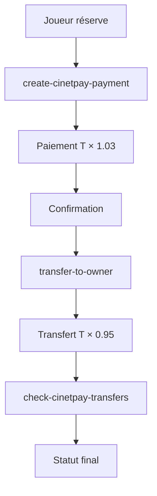

# PISport - Plateforme de Réservation de Terrains de Sport

PISport est une plateforme moderne de réservation de terrains de sport construite avec React, Supabase et intégrée avec CinetPay pour les paiements en Afrique de l'Ouest.

## 🏗️ Architecture

### Frontend
- **React 18** avec TypeScript
- **Tailwind CSS** pour le design
- **React Router** pour la navigation
- **React Query** pour la gestion d'état
- **Shadcn/ui** pour les composants UI

### Backend
- **Supabase** pour la base de données et l'authentification
- **Edge Functions** pour la logique métier
- **Row Level Security (RLS)** pour la sécurité des données

### Paiements
- **CinetPay** pour les paiements mobiles (Orange Money, MTN Money, etc.)
- **Système de commission à double niveau** (1,5% utilisateur + 3,5% propriétaire)

## 💰 Système de Paiement CinetPay

### Structure des Commissions (8% bruts)
- **Commission totale plateforme**: 8% du prix du terrain
- **Répartition**:
  - 3% payé par le joueur au moment du checkout (T × 1.03)
  - 5% déduit du payout vers le propriétaire (T × 0.95)
- **Frais CinetPay**: ~4% (3% Pay-In + 1% Transfer)
- **Marge nette plateforme**: ~4% (8% - 4%)

### Flux de Paiement (Payout Direct)



1. **Checkout** (`create-cinetpay-payment`)
   - Commission utilisateur: +3% (T × 1.03)
   - Création réservation avec commissions

2. **Transfert Propriétaire** (`transfer-to-owner`)
   - Commission propriétaire: -5% (T × 0.95)
   - Arrondi multiple de 5
   - Transfert CinetPay direct

3. **Monitoring Automatique**
   - Webhook (`cinetpay-transfer-webhook`)
   - Cron job toutes les 15min (`check-cinetpay-transfers`)

## 🎯 Fonctionnalités

### Pour les Joueurs
- 🔍 Recherche de terrains avec filtres avancés
- 📅 Réservation en temps réel
- 💳 Paiement sécurisé CinetPay
- ⭐ Système d'avis et notes
- 📱 Interface responsive

### Pour les Propriétaires
- 🏟️ Gestion des terrains
- 📊 Tableau de bord avec statistiques
- 💰 Suivi des paiements et revenus
- 📋 Gestion des disponibilités
- 🔄 Transferts automatiques

### Pour les Administrateurs
- 👥 Gestion des utilisateurs
- ✅ Validation des demandes propriétaires
- 📈 Analyse globale de la plateforme
- 🛡️ Gestion des rôles et permissions

## Installation locale

```bash
# Cloner le projet
git clone <YOUR_GIT_URL>
cd <YOUR_PROJECT_NAME>

# Installer les dépendances
npm install

# Lancer le serveur de développement
npm run dev
```

## 🧪 Tests

Le projet inclut une suite de tests Jest complète couvrant le workflow d'approbation des propriétaires :

```bash
# Lancer tous les tests
npm test

# Lancer les tests en mode watch
npm run test:watch
```

### Couverture de Tests (80+ tests)
- **Owner Approval Workflow** : Tests du processus complet application → approbation → intégration CinetPay
- **Payment Accounts Integration** : Tests de l'intégration avec CinetPay et gestion des comptes de paiement
- **Edge Function Integration** : Tests des fonctions Edge (owners-signup, create-owner-contact, request-owner-otp)
- **Database RPC Functions** : Tests des fonctions RPC (approve_owner_application, reject_owner_application)
- **Phone Normalization** : Tests complets de normalisation des numéros de téléphone (30+ tests)
- **Error Handling** : Tests des cas d'erreur et validation des contraintes de base de données
- **Security & Validation** : Tests des contraintes UNIQUE, permissions admin, validation OTP

## 🚀 Déploiement Edge Functions

```bash
# Déployer toutes les fonctions
supabase functions deploy

# Déployer une fonction spécifique
supabase functions deploy create-cinetpay-payment
supabase functions deploy transfer-to-owner
supabase functions deploy check-cinetpay-transfers
```

## 🔧 Edge Functions Actives

### Paiements CinetPay
- **create-cinetpay-payment** : Création de paiement CinetPay avec calcul des commissions
- **transfer-to-owner** : Transfert automatique vers le propriétaire après réservation confirmée
- **cinetpay-transfer-webhook** : Webhook pour les notifications de transfert
- **check-cinetpay-transfers** : Vérification automatique des transferts (toutes les 15min)

### Gestion des réservations
- **approve-booking** : Approbation d'une réservation par le propriétaire
- **confirm-booking-owner** : Confirmation finale par le propriétaire
- **cinetpay-webhook** : Webhook principal pour les notifications de paiement

### Workflow Propriétaires (Nouveau)
- **owners-signup** : Création d'application propriétaire avec vérification OTP
- **request-owner-otp** : Demande de code OTP pour vérification téléphone
- **create-owner-contact** : Ajout du contact propriétaire dans CinetPay après approbation admin

### Services auxiliaires
- **send-sms-notification** : Envoi de notifications SMS

## 👤 Owner Onboarding - Nouveau Workflow en 3 Étapes

Le système d'inscription des propriétaires suit maintenant un processus sécurisé en 3 étapes :

### 1. **Application** (`owners-signup`)
- Utilisateur s'inscrit via l'interface de candidature (`/become-owner`)
- Saisie des informations : nom complet, téléphone, expérience, motivation
- Vérification OTP obligatoire via `request-owner-otp`
- Création dans `owner_applications` avec statut `pending`
- Une seule application par utilisateur (contrainte UNIQUE sur `user_id`)

### 2. **Admin Approval** (Dashboard Admin)
- Admin valide la demande dans l'onglet "Demandes de propriétaires"
- RPC `approve_owner_application` vérifie :
  - ✅ Téléphone vérifié (`phone_verified_at` non null)
  - ✅ Pas de doublon de téléphone dans `owners`
  - ✅ Permissions admin requises
- Création automatique dans la table `owners` avec statut `approved`
- Attribution du rôle `owner` dans `user_roles`

### 3. **CinetPay Integration** (`create-owner-contact`)
- Appel automatique à l'Edge Function `create-owner-contact` après approbation
- Création du contact dans CinetPay Transfer API (ou mode test si credentials manquants)
- Enregistrement dans `payment_accounts` avec `was_already_existing` flag
- Gestion des cas d'erreur (contact déjà existant, API indisponible)
- Contact creation can fail without blocking the approval

## 📱 Normalisation des Numéros de Téléphone

Le système inclut une normalisation automatique des numéros de téléphone ivoiriens pour assurer la cohérence des données et éviter les doublons.

### Formats supportés en entrée
- **International complet** : `+2250701234567`
- **Sans le signe +** : `2250701234567`
- **Format local avec zéro** : `0701234567`
- **8 chiffres uniquement** : `70123456`
- **Avec espaces/tirets** : `+225 07 01 23 45 67`, `07-01-23-45-67`

### Format de sortie standardisé
Tous les numéros sont normalisés au format **+225XXXXXXXX** pour :
- Stockage en base de données (`owner_applications`, `owners`, `payment_accounts`)
- Vérification des doublons
- Affichage utilisateur

### Validation stricte
- Préfixes mobiles ivoiriens uniquement : **01** (Moov), **05** (MTN), **07/08/09** (Orange)
- Exactement 8 chiffres après le préfixe pays
- Rejet des numéros fixes ou étrangers

### Intégration CinetPay  
Pour les appels API CinetPay, les numéros sont convertis au format **XXXXXXXX** (8 chiffres sans +225).

### Variables d'environnement requises

```env
# CinetPay Transfer API (obligatoire pour les payouts)
CINETPAY_TRANSFER_LOGIN=your_transfer_login
CINETPAY_TRANSFER_PWD=your_transfer_password

# CinetPay Payment API (obligatoire pour les paiements)
CINETPAY_API_KEY=your_api_key
CINETPAY_SITE_ID=your_site_id
```

### Contraintes de sécurité et Intégrité

- **UNIQUE** contraintes sur `user_id` dans `owner_applications` (une application par utilisateur)
- **UNIQUE** contraintes sur `phone` dans `owner_applications` et `owners`
- Index de performance : `idx_payment_accounts_lookup` pour les requêtes de paiement
- **Normalisation automatique des numéros de téléphone** : tous les formats supportés (+225XXXXXXXX, 225XXXXXXXX, 0XXXXXXXX, XXXXXXXX)
- Validation stricte des préfixes mobiles ivoiriens (01, 05, 07, 08, 09)
- Vérification OTP obligatoire avant approbation admin
- Permissions admin requises pour approve/reject operations
- Foreign key constraints pour l'intégrité référentielle
- Migration `was_already_existing` dans `payment_accounts` pour tracking des contacts CinetPay

## Technologies utilisées

- **Frontend** : React, TypeScript, Tailwind CSS, Shadcn UI, Vite
- **Backend** : Supabase (PostgreSQL, Auth, Edge Functions, Storage)
- **Paiement** : CinetPay (Mobile Money, Carte bancaire)
- **Cartes** : Google Maps API
- **Déploiement** : Lovable

## How can I deploy this project?

Simply open [Lovable](https://lovable.dev/projects/28d006fa-38ed-4ef6-8275-056ce757f09a) and click on Share -> Publish.

## Can I connect a custom domain to my Lovable project?

Yes, you can!

To connect a domain, navigate to Project > Settings > Domains and click Connect Domain.

Read more here: [Setting up a custom domain](https://docs.lovable.dev/tips-tricks/custom-domain#step-by-step-guide)
