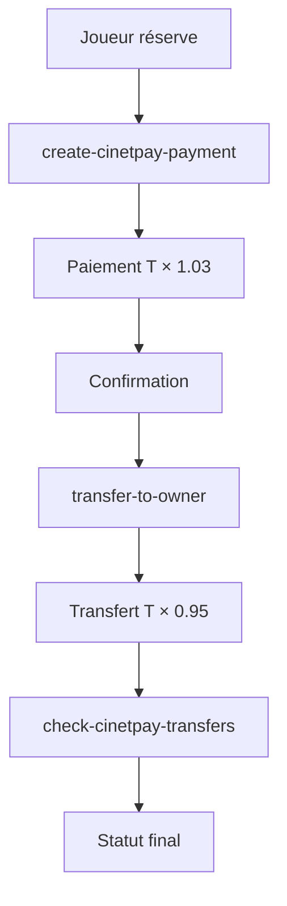

# MySport - Plateforme de Réservation de Terrains de Sport

MySport est une plateforme moderne de réservation de terrains de sport construite avec React, Supabase et intégrée avec CinetPay pour les paiements en Afrique de l'Ouest.

## 🏗️ Architecture

### Frontend
- **React 18** avec TypeScript
- **Tailwind CSS** pour le design
- **React Router** pour la navigation
- **React Query** pour la gestion d'état
- **Shadcn/ui** pour les composants UI

### Backend
- **Supabase** pour la base de données et l'authentification
- **Edge Functions** pour la logique métier
- **Row Level Security (RLS)** pour la sécurité des données

### Paiements
- **CinetPay** pour les paiements mobiles (Orange Money, MTN Money, etc.)
- **Système de commission à double niveau** (1,5% utilisateur + 3,5% propriétaire)

## 💰 Système de Paiement CinetPay

### Structure des Commissions (8% bruts)
- **Commission totale plateforme**: 8% du prix du terrain
- **Répartition**:
  - 3% payé par le joueur au moment du checkout (T × 1.03)
  - 5% déduit du payout vers le propriétaire (T × 0.95)
- **Frais CinetPay**: ~4% (3% Pay-In + 1% Transfer)
- **Marge nette plateforme**: ~4% (8% - 4%)

### Flux de Paiement (Payout Direct)



1. **Checkout** (`create-cinetpay-payment`)
   - Commission utilisateur: +3% (T × 1.03)
   - Création réservation avec commissions

2. **Transfert Propriétaire** (`transfer-to-owner`)
   - Commission propriétaire: -5% (T × 0.95)
   - Arrondi multiple de 5
   - Transfert CinetPay direct

3. **Monitoring Automatique**
   - Webhook (`cinetpay-transfer-webhook`)
   - Cron job toutes les 15min (`check-cinetpay-transfers`)

## 🎯 Fonctionnalités

### Pour les Joueurs
- 🔍 Recherche de terrains avec filtres avancés
- 📅 Réservation en temps réel
- 💳 Paiement sécurisé CinetPay
- ⭐ Système d'avis et notes
- 📱 Interface responsive

### Pour les Propriétaires
- 🏟️ Gestion des terrains
- 📊 Tableau de bord avec statistiques
- 💰 Suivi des paiements et revenus
- 📋 Gestion des disponibilités
- 🔄 Transferts automatiques

### Pour les Administrateurs
- 👥 Gestion des utilisateurs
- ✅ Validation des demandes propriétaires
- 📈 Analyse globale de la plateforme
- 🛡️ Gestion des rôles et permissions

## Installation locale

```bash
# Cloner le projet
git clone <YOUR_GIT_URL>
cd <YOUR_PROJECT_NAME>

# Installer les dépendances
npm install

# Lancer le serveur de développement
npm run dev
```

## 🚀 Déploiement Edge Functions

```bash
# Déployer toutes les fonctions
supabase functions deploy

# Déployer une fonction spécifique
supabase functions deploy create-cinetpay-payment
supabase functions deploy transfer-to-owner
supabase functions deploy check-cinetpay-transfers
```

## 🔧 Edge Functions Actives

### Paiements CinetPay
- **create-cinetpay-payment** : Création de paiement CinetPay avec calcul des commissions
- **transfer-to-owner** : Transfert automatique vers le propriétaire après réservation confirmée
- **cinetpay-transfer-webhook** : Webhook pour les notifications de transfert
- **check-cinetpay-transfers** : Vérification automatique des transferts (toutes les 15min)

### Gestion des réservations
- **approve-booking** : Approbation d'une réservation par le propriétaire
- **confirm-booking-owner** : Confirmation finale par le propriétaire
- **cinetpay-webhook** : Webhook principal pour les notifications de paiement

### Services auxiliaires
- **create-owner-contact** : Ajout du contact propriétaire dans CinetPay
- **send-sms-notification** : Envoi de notifications SMS

## Technologies utilisées

- **Frontend** : React, TypeScript, Tailwind CSS, Shadcn UI, Vite
- **Backend** : Supabase (PostgreSQL, Auth, Edge Functions, Storage)
- **Paiement** : CinetPay (Mobile Money, Carte bancaire)
- **Cartes** : Google Maps API
- **Déploiement** : Lovable

## How can I deploy this project?

Simply open [Lovable](https://lovable.dev/projects/28d006fa-38ed-4ef6-8275-056ce757f09a) and click on Share -> Publish.

## Can I connect a custom domain to my Lovable project?

Yes, you can!

To connect a domain, navigate to Project > Settings > Domains and click Connect Domain.

Read more here: [Setting up a custom domain](https://docs.lovable.dev/tips-tricks/custom-domain#step-by-step-guide)
