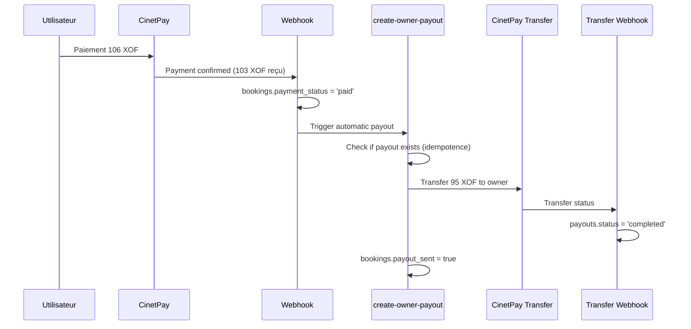

# Flux de Reversement Automatique 95% / 5%

## Vue d'ensemble

Le système implémente un reversement automatique vers les propriétaires de terrains dès qu'un paiement est confirmé par CinetPay.

### Modèle de frais : 100 → 103 → 106

```
Terrain (T)                 : 100 XOF
Frais MySport (3%)         : +3 XOF
Total envoyé à CinetPay    : 103 XOF
CinetPay (mode client-paye): +3 XOF (≈3%)
Total payé par client      : ≈106 XOF
```

### Répartition des revenus

- **Propriétaire** : 95% du prix terrain (95 XOF)
- **Plateforme MySport** : 5% du prix terrain (5 XOF)
- **Frais CinetPay** : Payés par le client, pas déduits du propriétaire

## Architecture

### 1. Paiement initial (`create-cinetpay-payment`)

```typescript
const fieldPrice = price;                            // T (100 XOF)
const platformFeeUser = Math.round(price * 0.03);    // 3% frais utilisateur (3 XOF)
const platformFeeOwner = Math.round(price * 0.05);   // 5% commission plateforme (5 XOF)
const ownerAmount = price - platformFeeOwner;        // 95% pour propriétaire (95 XOF)
const amountCheckout = price + platformFeeUser;      // Envoyé à CinetPay (103 XOF)
```

### 2. Webhook CinetPay (`cinetpay-webhook`)

- Reçoit la confirmation de paiement
- Met à jour `bookings.payment_status = 'paid'`
- Déclenche automatiquement `create-owner-payout`

### 3. Trigger automatique (`trigger_auto_payout`)

```sql
-- Déclenché quand payment_status passe à 'paid'
CREATE TRIGGER trigger_auto_payout_on_payment
  AFTER UPDATE ON public.bookings
  FOR EACH ROW
  EXECUTE FUNCTION public.trigger_auto_payout();
```

### 4. Création du payout (`create-owner-payout`)

- **Idempotence** : Vérifie si un payout existe déjà
- Récupère les détails propriétaire et compte paiement
- Appelle l'API CinetPay Transfer avec `owner_amount` (95 XOF)
- Crée l'enregistrement dans `payouts`
- Marque `bookings.payout_sent = true`

### 5. Confirmation transfert (`cinetpay-transfer-webhook`)

- Reçoit la confirmation CinetPay du transfert
- Met à jour `payouts.status` → `completed` ou `failed`
- Renseigne `payouts.sent_at`

## Tables modifiées

### `bookings`
```sql
-- Nouveaux champs
payout_sent BOOLEAN DEFAULT FALSE           -- Contrôle idempotence
field_price NUMERIC                         -- Prix terrain (T)
platform_fee_user NUMERIC                  -- 3% frais utilisateur
platform_fee_owner NUMERIC                 -- 5% commission plateforme
owner_amount NUMERIC                        -- 95% pour propriétaire

-- Champs supprimés
-- cinetpay_checkout_fee (obsolète)
```

### `payouts`
```sql
-- Nouveaux champs
amount_net NUMERIC                          -- Montant net versé
sent_at TIMESTAMP WITH TIME ZONE           -- Date confirmation transfert
```

## Variables d'environnement

```bash
# CinetPay Transfer API
CINETPAY_TRANSFER_LOGIN=your_transfer_login
CINETPAY_TRANSFER_PWD=your_transfer_password

# Existantes
CINETPAY_API_KEY=your_api_key
CINETPAY_SITE_ID=your_site_id
```

## Flux complet



## Sécurité et RLS

- **Payouts** : Lecture par propriétaire (`owner_id = auth.uid()`), écriture service-role
- **Idempotence** : Impossible de créer plusieurs payouts pour la même réservation
- **Validation** : Vérification que le paiement est confirmé avant transfert

## Monitoring

- Tous les logs sont timestampés
- Erreurs de transfert loggées sans faire échouer le paiement principal
- Table `payment_anomalies` pour les cas exceptionnels

## Tests

### Test unitaire - Calcul des frais
```typescript
// Terrain 100 XOF
expect(platformFeeUser).toBe(3);    // 3%
expect(platformFeeOwner).toBe(5);   // 5%
expect(ownerAmount).toBe(95);       // 95%
expect(amountCheckout).toBe(103);   // 103 XOF à CinetPay
```

### Test E2E - Flux complet
1. Paiement utilisateur → CinetPay
2. Webhook confirmation → `payment_status = 'paid'`
3. Trigger automatique → payout créé
4. Transfert CinetPay → propriétaire reçoit 95 XOF
5. Webhook transfert → `payouts.status = 'completed'`